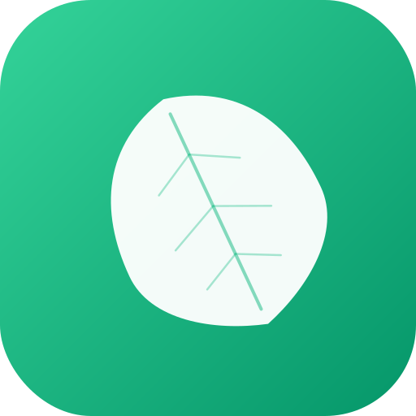

<p align="center">
  
</p>

<h1 align="center">小绿书</h1>

<p align="center">
  <b>反算法的个人内容策展平台</b><br>
  RSS 聚合 · AI 质量评分 · 人格化改写 · 零焦虑阅读
</p>

<p align="center">
  
  
  
  
</p>

---

## 为什么做这个？

小红书、今日头条们用算法喂你吃垃圾——标题党、软广、容貌焦虑、无限下拉。

**小绿书反过来：**

- 只从你亲手订阅的 RSS 源拉内容
- AI 逐篇打分，低质量的直接过滤掉
- 4 个 AI 作者人格改写内容，让阅读有温度
- 没有推送、没有红点、没有无限下拉

## 核心特性

| 特性 | 说明 |
|------|------|
| **多源聚合** | RSS/Atom 订阅，内置 18 个种子源（Hacker News、阮一峰、Paul Graham 等） |
| **AI 质量评分** | 1-10 分评估信息密度、原创性，过滤标题党和注水内容 |
| **人格化改写** | 科技小明 ⚡ · 投资笔记 📈 · 生活观察 🌿 · 深度阅读 📖 |
| **瀑布流浏览** | 移动端优先的卡片布局，无限滚动 + 下拉刷新 |
| **收藏与发现** | 收藏文章 → AI 分析偏好 → 推荐新内容 |
| **AI 评论互动** | 评论区中 AI 以作者人格角色扮演回复 |
| **标签筛选** | AI 自动打标签，按兴趣分类浏览 |
| **质量阈值** | 可调节最低评分，自己决定信息流的"纯度" |

## 快速开始

### 前置条件

- Node.js ≥ 18
- 至少一个 AI API Key（DeepSeek / Gemini / Qwen / OpenAI）

### 安装

```bash
git clone https://github.com/RoseYuan12138/xiaolvshu.git
cd xiaolvshu
npm install
cd server && npm install && cd ..
cd client && npm install && cd ..
```

### 配置

```bash
# server/.env
AI_PROVIDER=deepseek          # 可选: deepseek / gemini / qwen / openai
DEEPSEEK_API_KEY=sk-xxx       # 对应 provider 的 key
# GEMINI_API_KEY=
# QWEN_API_KEY=
# OPENAI_API_KEY=
```

### 启动

```bash
npm run dev
# 前端: http://localhost:5173
# 后端: http://localhost:3001
```

### 内容管线

首次启动后，运行全量管线抓取、评分、改写内容：

```bash
npm run pipeline        # 一键全流程: 抓取 → 评分 → 改写 → 发现
```

也可以单独运行每个阶段：

```bash
npm run fetch           # 抓取 RSS
npm run score           # AI 评分
npm run rewrite         # AI 人格化改写
npm run discover        # 内容发现（基于收藏推荐新源）
```

查看数据统计：

```bash
npm run stats           # 数据库统计概览
npm run show            # 查看文章内容质量
```

## 技术架构

```
┌─────────────────────────────────────────┐
│  Client (React 19 + Tailwind CSS 4)     │
│  Vite · 移动端优先 · emerald 色系        │
└────────────────┬────────────────────────┘
                 │ /api/*
┌────────────────▼────────────────────────┐
│  Server (Express 5 + TypeScript)        │
│  Routes · Services · ai-client.ts       │
└────────────────┬────────────────────────┘
                 │
     ┌───────────┼───────────┐
     ▼           ▼           ▼
  SQLite     AI APIs      RSS 源
  (WAL)    (多 provider)   (18+)
```

**关键模块：**

- `server/src/services/ai-client.ts` — 统一 AI 调用入口，所有 LLM 请求必须走这里
- `server/src/services/scoring.ts` — AI 评分（Quality Score 不可妥协）
- `server/src/services/rewriting.ts` — 人格化改写
- `server/src/services/discovery.ts` — 收藏驱动的内容发现
- `server/src/prompts/` — 所有 AI prompt 模板

## 项目结构

```
xiaolvshu/
├── client/                # React 前端
│   └── src/
│       ├── App.tsx        # 主应用（路由、状态）
│       ├── api.ts         # API 调用层
│       ├── constants.ts   # 共享常量（人格配置等）
│       └── components/    # UI 组件
├── server/                # Express 后端
│   └── src/
│       ├── index.ts       # 入口
│       ├── db/            # SQLite schema + 迁移
│       ├── routes/        # API 路由
│       ├── services/      # 业务逻辑
│       └── prompts/       # AI prompt 模板
└── scripts/               # 管线脚本
```

## 设计理念

**双评分系统：**
- **Quality Score**（质量分）— 护栏，不能弯。评估客观内容质量
- **Relevance Score**（相关分）— 方向盘，可以转。根据用户偏好调整

**反上瘾设计：**
- 无推送通知
- 无未读红点
- 无算法推荐
- 你订阅什么就看什么，AI 只负责过滤垃圾

## License

MIT
